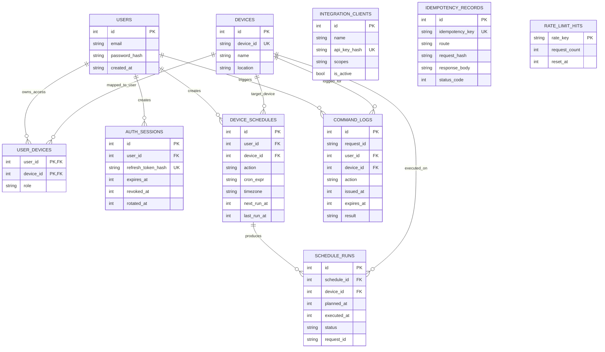

# Diagram Arsitektur Ekosistem SmartLamp IoT

Dokumen ini merangkum arsitektur aktual berdasarkan implementasi pada:

- `backend/src/server.ts`
- `backend/src/index.ts`
- `backend/src/routes/*.ts`
- `backend/src/lib/{mqtt-ws,realtime-mqtt-proxy,scheduler-runner,auth,session}.ts`
- `firmware/esp32-smartlamp/esp32-smartlamp.ino`
- `dashboard/src/lib/{api,realtime}.ts`
- `backend/migrations/*.sql`
- `docs/diagram/{diagram.html,blueprint.svg,arsitektur.svg}`

Artefak visual terkonsolidasi pada satu folder:
- `docs/diagram/diagram.html`
- `docs/diagram/blueprint.svg`
- `docs/diagram/arsitektur.svg`

## 1) Arsitektur Menyeluruh (Lokal + Cloud)


## 2) Detail Komunikasi dan Protokol

| Jalur | Arah | Protokol | Endpoint/Topic | Payload utama |
|---|---|---|---|---|
| Dashboard -> Backend | Browser ke API | HTTPS REST + JSON | `/api/v1/auth/*`, `/api/v1/bootstrap`, `/api/v1/commands/*`, `/api/v1/schedules*`, `/api/v1/devices*`, `/api/v1/status` | JSON request/response |
| Backend -> Dashboard | API ke Browser | SSE (`text/event-stream`) | `/api/v1/realtime/stream` | Event `hello`, `ping`, `status`, `lwt` |
| Integrasi eksternal -> Backend | Client integrasi ke API | HTTPS REST + Bearer API Key | `/api/v1/integrations/capabilities`, `/api/v1/devices*`, `/api/v1/schedules*`, dll | JSON |
| Backend -> Broker | Hono runtime ke HiveMQ | MQTT 3.1.1 over WSS (`mqtt` subprotocol) | `cmnd/{deviceId}/POWER`, `{deviceId}/cmnd/POWER` | payload `ON/OFF` (profile Tasmota) |
| Broker -> Backend (Node) | HiveMQ ke realtime proxy | MQTT 3.1.1 over WSS subscribe | `home/+/status`, `home/+/lwt`, `stat/+/POWER(1..8)`, `+/stat/POWER(1..8)`, `stat/+/RESULT`, `+/stat/RESULT`, `tele/+/STATE`, `+/tele/STATE`, `tele/+/LWT`, `+/tele/LWT` | JSON status + string LWT |
| ESP32 <-> Broker | Device ke HiveMQ | MQTT over TLS (TCP/8883) | `home/{deviceId}/cmd`, `home/{deviceId}/status`, `home/{deviceId}/lwt` | Command JSON, status JSON, LWT string |
| Tasmota <-> Broker | Device Tasmota ke broker | MQTT | `cmnd/{topic}/POWER`, `stat/{topic}/POWER|RESULT`, `tele/{topic}/STATE|LWT` | payload `ON/OFF`, JSON state, LWT `Online/Offline` |
| Node Backend -> MariaDB | App server ke DB | MariaDB protocol (TCP/3306) | tabel aplikasi | data auth/device/schedule/log |
| Worker Backend -> D1 | Worker ke DB cloud | Cloudflare D1 binding | tabel aplikasi | data auth/device/schedule/log |

## 3) Kontrak MQTT per Device


`CommandDispatch`:

```json
{
  "deviceId": "lampu-ruang-tamu",
  "action": "ON",
  "requestId": "uuid"
}
```

## 4) Sequence: Kontrol Lampu Manual (ON/OFF)


## 5) Sequence: Realtime Stream (Node vs Worker)


## 6) Sequence: Scheduler Otomatis


## 7) ERD Ringkas Database



## 8) Ringkasan Security Layer yang Terlibat

- Session auth: JWT HS256 untuk access token (`auth_token`) + opaque refresh token (`refresh_token`) di cookie HttpOnly.
- Idempotency API mutasi: header `Idempotency-Key` (server simpan `idempotency_records`).
- Rate limit: login dan command execute (`rate_limit_hits`).
