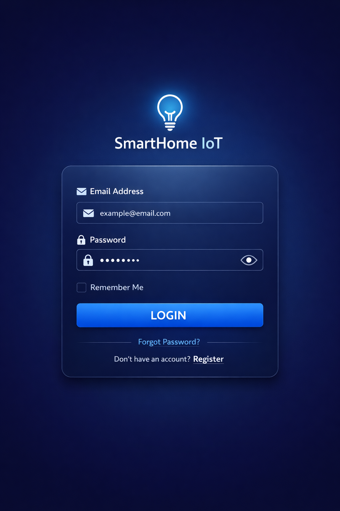
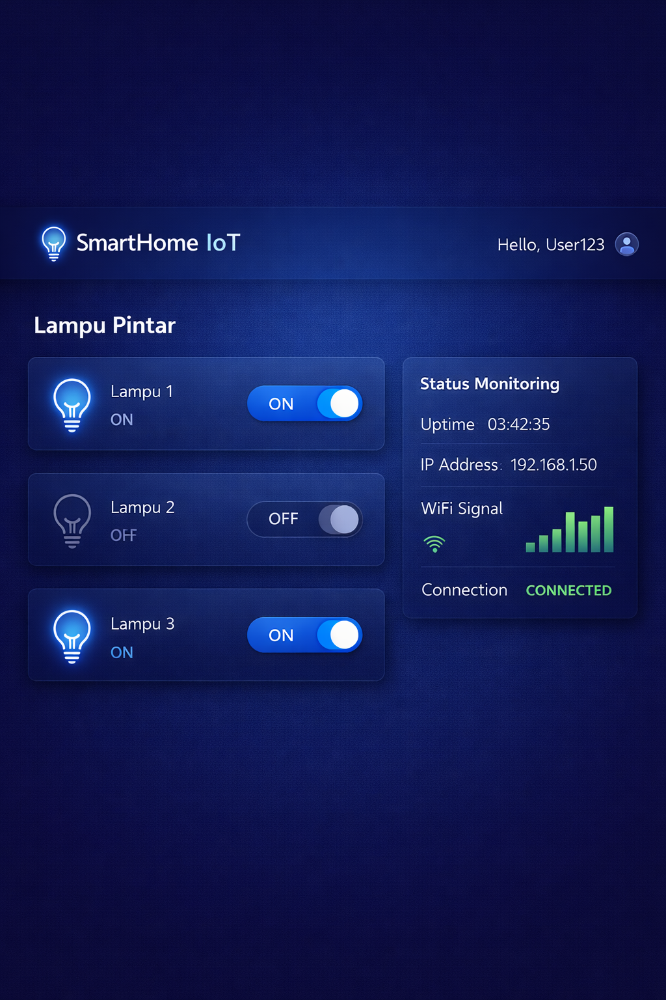

# ARSITEKTUR SISTEM IOT LAMPU PINTAR RUMAH TANGGA

## ESP32/Tasmota + HiveMQ + Node.js + Hono + Vite + MariaDB (Hybrid, Multi-Device)

Tanggal Dokumen: 21 February 2026

---

# 1. Tujuan Sistem

Arsitektur ini digunakan untuk kontrol lampu rumah tangga secara realtime dengan baseline berikut:

- Topologi `Hybrid`: backend Node.js untuk control plane, MQTT broker untuk data plane realtime.
- Skala `Multi-device`: tidak hardcoded ke `lampu1`.
- Broker `HiveMQ`: MQTT TLS untuk ESP32 dan MQTT over WebSocket (WSS) untuk backend proxy realtime.
- Framework backend wajib: `Hono` di atas Node.js runtime.
- Framework frontend wajib: `Vite` untuk build dashboard web.
- API bersifat `open integration` dengan standar kontrak REST yang stabil.
- Sistem mendukung `penjadwalan otomatis` ON/OFF berbasis waktu (cron + timezone).
- Keamanan command: `shared MQTT credential` + validasi akses di backend + idempotency + rate limit.
- Mode deployment utama: local server (self-host) dengan MariaDB.

---

# 2. Ringkasan Ekosistem

- `Vite App`: frontend dashboard (bundle/build via Vite).
- `Hono App + Node.js`: login JWT, authorisasi device, execute command (publish via backend), audit log, scheduler runner, dan realtime proxy MQTT -> SSE.
- `MariaDB`: users, devices, relasi user-device, dan command logs.
- `HiveMQ Broker`: bus pesan realtime MQTT.
- `ESP32 + Relay`: subscribe command native, eksekusi ON/OFF, publish status.
- `Tasmota Device`: menerima command `POWER`, publish status/LWT via topic `stat/tele`.

## 2.1 Standar Framework (Wajib)

- Backend API wajib menggunakan `Hono` framework.
- Frontend dashboard wajib menggunakan `Vite` tooling.
- Endpoint API didaftarkan via routing Hono (bukan handler runtime mentah).

---

# 3. Arsitektur Tingkat Tinggi

## 3.1 Control Plane (HTTPS)

```text
Dashboard (Browser)
  -> POST /api/v1/auth/login
  -> POST /api/v1/auth/refresh
  -> GET  /api/v1/bootstrap
  -> POST /api/v1/commands/execute
  -> GET  /api/v1/realtime/stream
  -> POST /api/v1/schedules
  -> GET  /api/v1/schedules
  -> GET  /api/v1/schedules/{scheduleId}
  -> PATCH /api/v1/schedules/{scheduleId}
  -> DELETE /api/v1/schedules/{scheduleId}
  -> GET  /api/v1/schedules/{scheduleId}/runs
  -> GET  /api/v1/status (fallback opsional)
  -> GET  /api/v1/devices
  -> GET  /api/v1/devices/{deviceId}/status

Backend Node.js (Hono)
  -> validasi JWT
  -> cek akses user-device
  -> publish command ON/OFF via backend proxy
  -> stream realtime status/lwt via SSE
  -> eksekusi scheduler trigger (due schedules)
  -> simpan audit ke MariaDB
```

## 3.2 Data Plane (MQTT Realtime)

```text
ESP32/Tasmota -- MQTT ----\
                           > HiveMQ Broker
Backend ------- MQTT WSS --/

Backend subscribe status/lwt dari profile Tasmota (`stat/*`, `tele/*`) lalu mem-forward ke SSE dashboard.
Backend publish command ke topik kanonik: `cmnd/{deviceId}/POWER`.
Device mengeksekusi command `POWER` dan mem-publish status/LWT sesuai profil topic.
```

---

# 4. Alur Operasional Inti

## 4.1 Login

1. User input email/password di dashboard.
2. Dashboard kirim `POST /api/v1/auth/login`.
3. Backend verifikasi password hash di MariaDB (`bcrypt`, fallback legacy hash untuk migrasi).
4. Backend set access token cookie + refresh token cookie.

## 4.2 Refresh Session (Rotasi Token)

1. Saat access token expired, dashboard kirim `POST /api/v1/auth/refresh`.
2. Backend validasi refresh token cookie terhadap tabel `auth_sessions`.
3. Jika valid, backend membuat refresh session baru dan merotasi session lama.
4. Backend menerbitkan access token baru + refresh token baru.

## 4.3 Bootstrap Session

1. Dashboard kirim `GET /api/v1/bootstrap` dengan JWT.
2. Backend return daftar device yang bisa diakses user.
3. Backend return konfigurasi realtime stream (`mode=proxy_sse`, `streamPath=/api/v1/realtime/stream`).
4. Dashboard membuka SSE ke backend dan menerima event status/lwt sesuai akses device user.

## 4.4 Kontrol Lampu (Backend Command)

1. User klik ON/OFF pada device tertentu.
2. Dashboard request `POST /api/v1/commands/execute` ke backend.
3. Backend validasi JWT + akses device.
4. Backend publish command ke topik kanonik: `cmnd/{deviceId}/POWER`.
5. Backend simpan audit command ke MariaDB.
6. Device menjalankan ON/OFF lalu publish status terbaru (Tasmota).

## 4.5 Realtime Status

1. Device publish status ke broker Tasmota: `stat/{topic}/POWER|RESULT`, `tele/{topic}/STATE`.
2. Device publish LWT Tasmota: `tele/{topic}/LWT`.
3. Backend subscribe event dari broker MQTT lalu stream ke dashboard via SSE.
4. `GET /api/v1/status` dipakai sebagai fallback non-realtime (opsional).

## 4.6 Penjadwalan Otomatis (Scheduler)

1. User membuat jadwal ON/OFF per device via `POST /api/v1/schedules`.
2. Backend validasi JWT + akses user-device + validasi cron dan timezone.
3. Backend simpan rule jadwal ke MariaDB dan hitung `next_run_at`.
4. Scheduler process di backend berjalan periodik (misalnya per menit) untuk mengambil jadwal jatuh tempo.
5. Untuk setiap jadwal due, backend membangun command ON/OFF seperti command manual.
6. Backend publish command schedule ke broker (MQTT over WSS) ke topik kanonik: `cmnd/{deviceId}/POWER`.
7. Backend simpan hasil eksekusi ke `schedule_runs` dan update `next_run_at`.

---

# 5. Kontrak MQTT Multi-Device

## 5.1 Topic Naming

Tasmota profile (didukung):
- Command: `cmnd/{deviceId}/POWER` (kanonik).
- Status: `stat/{deviceId}/POWER` s.d. `POWER8`, `stat/{deviceId}/RESULT`, `tele/{deviceId}/STATE`.
- LWT: `tele/{deviceId}/LWT` atau `{deviceId}/tele/LWT`.

Catatan kompatibilitas Tasmota:
- Direkomendasikan Prefix default Tasmota: `cmnd`, `stat`, `tele`.
- FullTopic yang didukung backend: `%prefix%/%topic%/` dan `%topic%/%prefix%/`.

## 5.2 QoS dan Retain

- `cmd`: QoS 1, retain = false
- `status`: QoS 1, retain = true
- `lwt`: QoS 1, retain = true

Untuk Tasmota, QoS/retain mengikuti konfigurasi perangkat; backend kompatibel dengan payload `ON/OFF` command dan event `POWER/RESULT/STATE/LWT`.

## 5.3 Payload Kontrak

### Command Execute Request (Dashboard -> Backend)

```ts
type CommandExecuteRequest = {
  deviceId: string;
  action: "ON" | "OFF";
  requestId: string;
};
```

### Command Dispatch (Backend -> MQTT cmd topic)

```ts
type CommandDispatch = {
  deviceId: string;
  action: "ON" | "OFF";
  requestId: string;
};
```

### Device Status (ESP32 -> MQTT status topic)

```ts
type DeviceStatus = {
  deviceId: string;
  power: "ON" | "OFF";
  ts: number;
  rssi?: number;
  requestId?: string;
};
```

### Schedule Rule (API Scheduler)

```ts
type ScheduleRule = {
  id: string;
  deviceId: string;
  action: "ON" | "OFF";
  cron: string;
  timezone: string; // IANA tz, contoh: Asia/Jakarta
  enabled: boolean;
  nextRunAt: string; // ISO-8601 UTC
};
```

### Schedule Run Result

```ts
type ScheduleRun = {
  scheduleId: string;
  plannedAt: string;
  executedAt?: string;
  status: "SUCCESS" | "FAILED" | "SKIPPED";
  requestId?: string;
  reason?: string;
};
```

---

# 6. API Contract Backend

## 6.1 POST /api/v1/auth/login

Fungsi:
- autentikasi user
- return JWT untuk control plane

## 6.2 POST /api/v1/auth/refresh

Fungsi:
- refresh access token saat expired
- rotasi refresh session (old session revoked, new session issued)

## 6.3 GET /api/v1/bootstrap

Fungsi:
- return daftar device user
- return konfigurasi realtime stream backend untuk dashboard

Response minimal:
- `devices[]`
- `realtime.mode` (`proxy_sse`)
- `realtime.streamPath` (`/api/v1/realtime/stream`)

## 6.4 POST /api/v1/commands/execute

Fungsi:
- endpoint operasional utama untuk publish command ON/OFF ke broker dari backend
- butuh validasi JWT + akses user-device
- endpoint ini yang dipakai dashboard saat kontrol ON/OFF

## 6.5 Scheduler Endpoints

- `POST /api/v1/schedules`
- `GET /api/v1/schedules`
- `GET /api/v1/schedules/{scheduleId}`
- `PATCH /api/v1/schedules/{scheduleId}`
- `DELETE /api/v1/schedules/{scheduleId}`
- `GET /api/v1/schedules/{scheduleId}/runs`

Fungsi:
- membuat dan mengelola jadwal otomatis ON/OFF.
- menyimpan history eksekusi schedule.
- mendukung kontrol pause/resume via field `enabled`.

## 6.6 GET /api/v1/status (Opsional Fallback)

Fungsi:
- memberi snapshot status saat dashboard baru masuk/reconnect
- bukan sumber realtime utama

## 6.7 Open Integration Endpoints

- `GET /api/v1/integrations/capabilities`
- `GET /api/v1/devices`
- `GET /api/v1/devices/{deviceId}`
- `GET /api/v1/devices/{deviceId}/status`
- `GET /api/v1/schedules`
- `GET /api/v1/schedules/{scheduleId}`
- `GET /api/v1/schedules/{scheduleId}/runs`
- `GET /api/v1/openapi.json`

Tujuan:
- memberi kontrak API publik yang stabil untuk pihak ketiga
- discovery fitur yang tersedia
- dokumentasi schema yang bisa di-generate client otomatis

## 6.8 Standar Kontrak API (Open Integration)

### Versi API

- Prefix wajib: `/api/v1`.
- Perubahan breaking harus melalui versi baru (`/api/v2`), bukan mengganti kontrak v1.

### Header Wajib

- `Content-Type: application/json`
- `Authorization: Bearer <jwt_or_api_key>`
- `X-Request-Id: <uuid>` (disarankan)
- `Idempotency-Key: <uuid>` untuk request mutasi (`POST /commands/execute`, `POST /schedules`, `PATCH /schedules/{id}`, `DELETE /schedules/{id}`)

### Mode Autentikasi Open Integration

- `JWT`: untuk dashboard/session user.
- `API Key`: untuk service-to-service integrasi pihak ketiga.
- API key harus disimpan dalam bentuk hash (`api_key_hash`) dan dibatasi dengan scope.

### Response Envelope

Semua response JSON mengikuti envelope standar:

```json
{
  "success": true,
  "data": {},
  "error": null,
  "meta": {
    "requestId": "uuid",
    "timestamp": "2026-02-16T12:00:00Z",
    "version": "v1"
  }
}
```

### Error Envelope

```json
{
  "success": false,
  "data": null,
  "error": {
    "code": "FORBIDDEN_DEVICE_ACCESS",
    "message": "User has no access to this device",
    "details": {}
  },
  "meta": {
    "requestId": "uuid",
    "timestamp": "2026-02-16T12:00:00Z",
    "version": "v1"
  }
}
```

### Kode Error Minimum

- `AUTH_INVALID_TOKEN`
- `AUTH_EXPIRED_TOKEN`
- `FORBIDDEN_DEVICE_ACCESS`
- `DEVICE_NOT_FOUND`
- `VALIDATION_ERROR`
- `SCHEDULE_NOT_FOUND`
- `SCHEDULE_INVALID_CRON`
- `SCHEDULE_INVALID_TIMEZONE`
- `IDEMPOTENCY_CONFLICT`
- `RATE_LIMITED`

---

# 7. Skema Database MariaDB (Revisi)

Skema aktual berada di:
- `backend/migrations-mariadb/0001_schema.sql`

Entitas utama:
- `users`, `auth_sessions`
- `devices`, `user_devices`
- `command_logs`
- `device_schedules`, `schedule_runs`
- `integration_clients`, `idempotency_records`, `rate_limit_hits`

---

# 8. Model Keamanan

## 8.1 Identitas dan Akses

- User auth memakai JWT.
- Session auth menggunakan access token TTL pendek + refresh token rotation.
- Authorisasi command selalu diverifikasi di backend berdasarkan tabel `user_devices`.
- Operasi schedule (`create/update/delete`) wajib melewati validasi akses user-device yang sama.

## 8.2 Shared Broker Credential (Keputusan Fase Ini)

- Hanya backend dan ESP32 yang memakai credential broker.
- Frontend tidak menerima kredensial broker.
- Semua command wajib dipublish dari backend.

## 8.3 Anti-Spoof dan Anti-Replay

Kontrol anti-spoof/replay pada fase ini:
- command publish hanya lewat backend (frontend tidak memegang kredensial broker)
- JWT + akses device diverifikasi sebelum publish
- idempotency key mencegah replay request mutasi di sisi API

## 8.4 Secret Handling

- JWT secret disimpan di environment backend.
- Kredensial MQTT hanya tersedia di backend/worker dan tidak diekspos ke frontend.

## 8.5 Password dan Rate Limit

- Password user diverifikasi dengan `bcrypt` (`$2b$...`) di backend.
- Legacy hash `SHA-256` masih didukung sementara untuk kompatibilitas seed lama, lalu auto-upgrade ke bcrypt setelah login sukses.
- Rate limit wajib aktif minimal untuk:
  - `POST /api/v1/auth/login`
  - `POST /api/v1/commands/execute`
- Error untuk limit terlampaui menggunakan code `RATE_LIMITED` + `retry-after`.

---

# 9. Reliabilitas Realtime

- Dashboard wajib auto-reconnect SSE ke endpoint backend.
- Backend proxy realtime (Node runtime) wajib reconnect ke MQTT broker jika koneksi terputus.
- Sinkron state awal dilakukan dari snapshot status DB saat stream dibuka.
- Device offline dideteksi dari event LWT yang diteruskan backend.
- Pada runtime Worker, realtime stream subscribe MQTT langsung per koneksi SSE + snapshot LWT retained via MQTT over WSS.
- Scheduler runner harus idempotent (mencegah eksekusi ganda pada menit yang sama).
- Perhitungan jadwal harus berbasis timezone IANA untuk menangani DST secara konsisten.

---

# 10. Dukungan Deployment (Lokal + Cloudflare)

Arsitektur ini didukung pada tiga mode deploy dengan codebase yang sama:

- Local development (2 port: backend + frontend Vite).
- Local production (single port: backend + static frontend).
- Cloudflare production (single Worker + D1, frontend assets dan API pada URL yang sama).

## 10.1 Local Development

1. Siapkan root env: `cp .env.example .env`.
2. Generate env lokal turunan: `npm run env:local`.
3. Jalankan migrasi MariaDB lokal: `npm run migrate:local`.
4. Jalankan backend + frontend: `npm run dev`.
5. Verifikasi alur login, execute command (`/api/v1/commands/execute`), dan update status realtime via SSE.
6. Uji endpoint scheduler (`/api/v1/schedules`) dan simulasi eksekusi due schedule di environment lokal.

## 10.2 Local Production (Single Port)

1. Siapkan root env: `cp .env.example .env`.
2. Set `BACKEND_SERVE_DASHBOARD=true` dan `BACKEND_PORT` sesuai kebutuhan.
3. Generate env production turunan: `npm run env:production`.
4. Jalankan migrasi MariaDB production: `npm run migrate:production`.
5. Build frontend Vite: `npm run build`.
6. Jalankan server production: `npm run start:production`.
7. Verifikasi endpoint API dan halaman dashboard pada satu origin/port yang sama.

## 10.3 Cloudflare Deployment

1. Gunakan konfigurasi Worker pada `backend/wrangler.toml`.
2. Pastikan binding D1, cron trigger, dan assets binding sudah sesuai.
3. Set vars/secrets Worker dari root `.env` (dibantu `scripts/deploy-worker.sh`).
4. Jalankan migrasi D1 remote: `npm run migrate:remote`.
5. Deploy Worker: `npm run deploy:worker`.
6. Verifikasi end-to-end pada URL Worker production (single URL).

## 10.4 Metode Verifikasi Wajib

- Semua verifikasi UI dan E2E dilakukan menggunakan `Playwright MCP`.
- Verifikasi dilakukan minimal pada 3 target:
  - local development
  - local production single port
  - cloudflare production
- Hasil verifikasi wajib menyertakan evidence pass/fail per skenario.

---

# 11. Kriteria Sukses

- Multi-device berfungsi dengan topic pattern dinamis.
- Realtime update dashboard berjalan via SSE backend proxy.
- Backend realtime proxy MQTT stabil pada Node runtime.
- Runtime Worker tetap berfungsi dengan subscribe MQTT realtime + snapshot LWT.
- Audit command tersimpan di MariaDB.
- Scheduler otomatis ON/OFF berjalan stabil berbasis cron + timezone.
- Open Integration API v1 tersedia dengan kontrak stabil dan endpoint discovery.
- OpenAPI JSON tersedia di `/api/v1/openapi.json`.
- Semua skenario kritikal lulus verifikasi melalui Playwright MCP pada local dan production.

---

# 12. Catatan Scope

- Arsitektur ini ditujukan untuk dashboard web sebagai klien utama.
- Native mobile app tidak termasuk scope fase ini.

---

# 13. Blueprint dan TODO Implementasi (Inline)

## 13.1 PHASE 1 - Hardware dan Provisioning Device

- [ ] Rakit ESP32 + relay + lampu. *(manual hardware)*
- [ ] Tetapkan `deviceId` unik per board. *(manual provisioning per device)*
- [ ] Konfigurasi WiFi dan broker endpoint. *(manual per board)*
- [ ] Uji manual ON/OFF relay lokal. *(uji fisik)*

## 13.2 PHASE 2 - Firmware ESP32

- [x] Implement MQTT TLS connect + reconnect.
- [x] Konfigurasi command profile Tasmota `cmnd/{deviceId}/POWER`.
- [x] Publish `status` retained setelah setiap perubahan state.
- [x] Konfigurasi LWT `ONLINE/OFFLINE`.

Implementasi referensi tersedia di:
- `firmware/esp32-smartlamp/esp32-smartlamp.ino`
- `firmware/esp32-smartlamp/README.md`

Catatan:
- Checklist Phase 2 di atas menandai implementasi kode firmware sudah tersedia.
- Validasi hardware fisik tetap mengikuti checklist Phase 1 dan checklist verifikasi yang masih `pending`.

## 13.3 PHASE 3 - Backend Node.js (Hono)

- [x] Scaffold backend pakai Hono (`npm create hono@latest`).
- [x] Konfigurasi runtime Node.js untuk backend Hono.
- [x] Setup koneksi MariaDB dan migrasi otomatis.
- [x] Pastikan API bisa jalan lokal via server Node (`PORT=8787`).
- [x] Implement route v1 `POST /api/v1/auth/login` + JWT.
- [x] Implement route v1 `POST /api/v1/auth/refresh` + refresh token rotation.
- [x] Implement route v1 `GET /api/v1/bootstrap` (device list + realtime stream config).
- [x] Implement route v1 `POST /api/v1/commands/execute`.
- [x] Implement route v1 `POST /api/v1/schedules`.
- [x] Implement route v1 `GET /api/v1/schedules`.
- [x] Implement route v1 `GET /api/v1/schedules/{scheduleId}`.
- [x] Implement route v1 `PATCH /api/v1/schedules/{scheduleId}`.
- [x] Implement route v1 `DELETE /api/v1/schedules/{scheduleId}`.
- [x] Implement route v1 `GET /api/v1/schedules/{scheduleId}/runs`.
- [x] Implement route v1 `GET /api/v1/status` fallback snapshot.
- [x] Implement endpoint integrasi `GET /api/v1/integrations/capabilities`.
- [x] Implement endpoint integrasi `GET /api/v1/devices`.
- [x] Implement endpoint integrasi `GET /api/v1/devices/{deviceId}`.
- [x] Implement endpoint integrasi `GET /api/v1/devices/{deviceId}/status`.
- [x] Implement `GET /api/v1/openapi.json`.
- [x] Implement scheduler runner pada process backend (interval periodik).
- [x] Implement kalkulasi `next_run_at` (cron + timezone IANA).
- [x] Implement log eksekusi jadwal ke `schedule_runs`.
- [x] Implement publish command schedule ke topik kanonik `cmnd/{deviceId}/POWER`.
- [x] Implement middleware response envelope standar (`success/data/error/meta`).
- [x] Implement API key auth + scope check untuk akses integrasi.
- [x] Implement idempotency middleware untuk endpoint mutasi.
- [x] Implement audit ke `command_logs`.

## 13.4 PHASE 4 - Dashboard Frontend (Vite)

- [x] Scaffold frontend pakai Vite (`npm create vite@latest`).
- [x] Setup env var API base URL dari root shared env.
- [x] Pastikan dashboard bisa jalan lokal via `npm run dev` dan hit API lokal.
- [x] Halaman login + secure token handling.
- [x] Device list dinamis multi-device.
- [x] SSE realtime client + auto reconnect.
- [x] Subscribe status/lwt via endpoint backend `/api/v1/realtime/stream`.
- [x] Request execute command ke backend (`/api/v1/commands/execute`).
- [x] Tampilkan ack status dan offline indicator per device.
- [x] Tambahkan UI manajemen jadwal (buat/list/edit/hapus jadwal).
- [x] Tampilkan status next run dan riwayat eksekusi schedule di dashboard.

## 13.5 PHASE 5 - Security Hardening

- [x] Password hash kuat (Bcrypt di backend pipeline).
- [x] JWT expiry pendek + refresh policy sesuai kebutuhan.
- [x] CORS restrict hanya origin dashboard.
- [x] Rate limit endpoint auth/command.
- [x] Simpan semua secret di environment backend.

## 13.6 PHASE 6 - Testing dan Validasi

- [x] Semua test UI/E2E dijalankan via Playwright MCP (bukan verifikasi manual saja).
- [x] Test local mode: dashboard Vite + API Hono (Node.js) berjalan end-to-end.
- [x] Test production-local mode (single port) untuk alur login/dashboard/schedule/stream (command execute masih tergantung kredensial MQTT valid).
- [x] Verifikasi kontrak Open Integration API v1 (status code, envelope JSON, error code).
- [x] Verifikasi endpoint `GET /api/v1/openapi.json` dapat diakses dan valid.
- [x] Verifikasi API key scope membatasi akses endpoint sesuai role.
- [x] Verifikasi idempotency key mengembalikan response konsisten untuk request duplikat.
- [x] Verifikasi create/update/delete schedule dari dashboard berjalan.
- [x] Verifikasi scheduler mengeksekusi ON/OFF otomatis sesuai cron.
- [x] Verifikasi timezone/DST tidak menggeser jadwal secara tidak valid.
- [x] Verifikasi schedule pause/resume via field `enabled`.
- [x] Verifikasi retry dan dedup mencegah double-execution (`schedule_runs` unik per slot waktu).
- [x] Login benar/salah.
- [x] Token expired.
- [x] User A tidak bisa execute command device User B.
- [x] Device offline tampil realtime dari LWT.
- [x] Reconnect dashboard: resubscribe + state sinkron.
- [x] Uji paralel minimal 10 device.
- [x] Catat latency end-to-end command sampai status ack.
- [x] Simpan evidence Playwright MCP (screenshot dan catatan pass/fail per skenario).

Catatan verifikasi terakhir:
- Tanggal: 21 February 2026 (local + cloud + sinkronisasi kompatibilitas Tasmota).
- Tool: Playwright MCP.
- Evidence screenshot local: tersimpan pada output sesi Playwright MCP runner (artefak sesi, tidak disimpan permanen di root repo).
- Verifikasi tambahan API local: API key scope, idempotency replay/mismatch, rate-limit auth/command, dan refresh token rotation (lihat `PLAYWRIGHT_VERIFICATION.md`).
- Cloud verification sudah dijalankan pada URL Worker single deploy (`/` dan `/api/*` di origin yang sama).
- Catatan blocker saat ini: publish command ke broker gagal auth (`MQTT CONNACK code 5`) jika kredensial MQTT tidak valid.
- Verifikasi tambahan unit/integration backend (17 February 2026):
  - `backend/test/schedules.test.ts`: validasi DST timezone.
  - `backend/test/scheduler-runner.test.ts`: dedup schedule slot mencegah publish ganda.
  - `backend/test/authz.test.ts`: JWT expired -> `AUTH_EXPIRED_TOKEN`, dan user tanpa akses device -> `FORBIDDEN_DEVICE_ACCESS`.
- Verifikasi kompatibilitas MQTT Tasmota (21 February 2026):
  - `backend/test/mqtt-compat.test.ts`: parser/pemetaan topic `stat|tele` + variasi FullTopic.
  - `backend/test/mqtt-command-publish.test.ts`: publish command topik kanonik (`cmnd/{deviceId}/POWER`).
  - `npm --prefix backend test`: semua test lulus.
- Verifikasi Playwright + MQTT (17 February 2026, local dev):
  - Publish `tele/lampu-ruang-tamu/LWT = OFFLINE/ONLINE` memicu update badge device realtime.
  - Setelah reload dashboard, stream SSE kembali aktif dan event LWT tetap diterima (resubscribe + state sinkron).
- Verifikasi paralel + latency (17 February 2026, cloud Worker):
  - `scripts/verify-parallel-devices.sh` -> 10 device dieksekusi paralel, hasil `OK: 10`, `FAIL: 0`.
  - `scripts/measure-status-ack-latency.sh` -> contoh hasil:
    - API execute latency: `3486 ms`
    - End-to-end request -> status ack observed: `7375 ms`
  - Catatan: status ack pada pengukuran latency memakai publisher simulasi MQTT (`source=latency-sim`) untuk mengukur jalur command -> broker -> status.
- Demo free-tier (17 February 2026):
  - Cloudflare Worker single URL + D1 + HiveMQ Cloud free tier berjalan untuk login/dashboard/command/schedule.
  - Jalur status ack end-to-end untuk pengukuran otomatis menggunakan publisher simulasi (`latency-sim`) di topic MQTT.

---

# 14. Definition of Done (Inline)

- [x] Semua endpoint utama tersedia dan terdokumentasi.
- [x] Multi-device berjalan tanpa hardcoded topic.
- [x] Signed command diberlakukan end-to-end.
- [x] Dashboard realtime via SSE backend stabil.
- [x] Manajemen jadwal otomatis berfungsi (create/edit/delete/pause/resume).
- [x] Scheduler interval backend mengeksekusi command terjadwal sesuai timezone.
- [x] API berjalan di Hono Node.js dan frontend dibangun via Vite.
- [x] Deployment lokal (dev + production single port) lulus smoke test (dengan catatan MQTT credential valid dibutuhkan untuk publish command).
- [x] Deployment cloudflare (single Worker + D1) lulus smoke test.
- [x] Verifikasi E2E local + cloud lulus melalui Playwright MCP.
- [x] Open Integration API v1 terdokumentasi dan lulus contract verification.
- [x] Audit command tersimpan di MariaDB.
- [x] Demo end-to-end berjalan penuh di jalur free tier.

---

# 15. Verifikasi MQTT via WebSocket (Node.js/Cloudflare <-> HiveMQ)

Status verifikasi: `DIDUKUNG` dengan konfigurasi yang benar.

Ringkasan teknis:
- HiveMQ menyediakan endpoint TLS WebSocket untuk client web.
- HiveMQ broker mendukung listener MQTT over WebSocket dan subprotocol MQTT.
- Runtime Node.js mendukung WebSocket client (`new WebSocket(...)`) untuk MQTT over WSS.
- Cloudflare Workers juga mendukung WebSocket client untuk koneksi `wss://`.
- Outbound WebSocket backend perlu dibatasi concurrency agar stabil pada scheduler.

Implikasi arsitektur:
- `Browser dashboard -> Backend SSE` dipakai untuk realtime dashboard.
- `Backend Node.js -> HiveMQ (WSS)` dipakai untuk proxy status/lwt dan publish command.
- `Cloudflare Worker -> HiveMQ (WSS)` dipakai untuk publish command, subscribe status/lwt per stream SSE, dan snapshot LWT retained.

Guardrails implementasi:
- Gunakan endpoint `wss://` resmi dari HiveMQ cluster.
- Gunakan subprotocol MQTT yang sesuai (`mqtt`/`mqttv3.1`) bila diperlukan listener broker.
- Node runtime boleh memakai long-lived MQTT subscribe untuk proxy realtime.
- Runtime Worker gunakan subscribe MQTT per koneksi SSE (tanpa proxy global process-wide) + snapshot LWT retained.

---

# 16. Contoh Tampilan

## 16.1 Login Page



## 16.2 Dashboard


