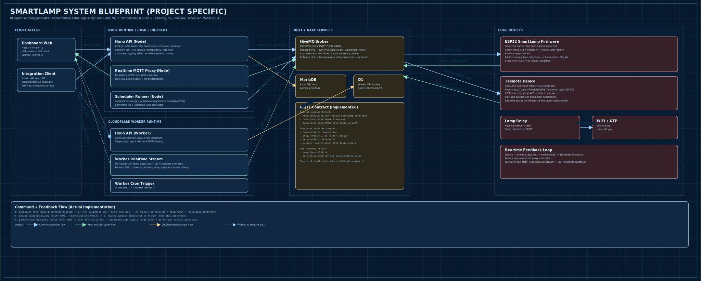
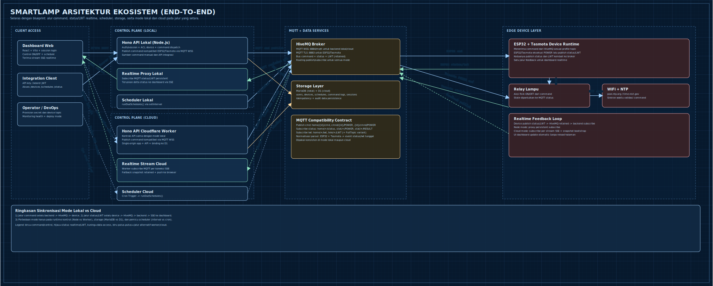

# Gambar Blueprint dan Block Diagram

## Ilustrasi End-to-End (Detail)

- Buka langsung di browser: [`diagram.html`](./diagram.html)
- Blueprint: [`blueprint.svg`](./blueprint.svg)
- Arsitektur: [`arsitektur.svg`](./arsitektur.svg)
- Serve lokal cepat:
  - `python3 -m http.server 4173 --directory /home/robert/Lampu-PIntar-Rumah-Tangga/docs/diagram`
  - Buka:
    - `http://127.0.0.1:4173/diagram.html`
    - `http://127.0.0.1:4173/blueprint.svg`
    - `http://127.0.0.1:4173/arsitektur.svg`

Catatan:
- Ikon teknologi pada ilustrasi diambil dari Simple Icons: `docs/diagram/assets/icons/`.
- Sumber: `https://cdn.simpleicons.org/react`, `https://cdn.simpleicons.org/nodedotjs`, `https://cdn.simpleicons.org/cloudflare`, `https://cdn.simpleicons.org/hivemq`, `https://cdn.simpleicons.org/mariadb`, `https://cdn.simpleicons.org/espressif`, `https://cdn.simpleicons.org/arduino`.

## Blueprint Arsitektur IoT

## Block Diagram Ekosistem

## Akses Cepat via URL

- Jalankan dengan root `docs`:
  - `python3 -m http.server 4173 --directory /home/robert/Lampu-PIntar-Rumah-Tangga/docs`
- Buka:
  - `http://127.0.0.1:4173/diagram/diagram.html`
  - `http://127.0.0.1:4173/diagram/blueprint.svg`
  - `http://127.0.0.1:4173/diagram/arsitektur.svg`
